# Introduction

*Lawrence N Hudson - software engineer, Ben W Price - curator of small orders
and Natalie Dale-Skey - curator of Hymenoptera*

This workshop will give a comprehensive overview of the Inselect desktop 
software and its associated command-line tools.

* Background for the workshop is at
http://synthesys3.biowikifarm.net/syn3/SPNHCworkshop2016.
* Inselect's home page with source code, issues and releases is
https://github.com/NaturalHistoryMuseum/inselect
* [SYNTHESYS](http://www.synthesys.info/)
* [iDigBio](https://www.idigbio.org/)

## Topics

This workshop will cover

* image and file handling;
* automatic segmentation of images;
* metadata templates, including user-defined fields and validation;
* barcode reading;
* exporting image crops;
* exporting of metadata to `CSV` files;
* cookie cutter templates and
* command-line tools for unattended batch processing of images.

## Acknowledgements

* Prototype and segmentation algorithm: Pieter Holtzhausen and Stéfan van der Walt
* Project oversight: Laurence Livermore, Vladimir Blagoderov and Vincent Smith
* Application development: Alice Heaton and Lawrence Hudson
* User testing: Louise Allan, Natalie Dale-Skey and nearly 40 NHM volunteers

Inslect has received support from
* SYNTHESYS European Community Research Infrastructure Action under the FP7
  Integrating Activities Programme (Grant agreement number 312253) and
* The U.K. [Natural Environment Research Council](http://www.nerc.ac.uk/).

## Preparation

1. Download and run the appropriate installer for the latest release of Inselect
(at time of writing, v0.1.33) from the [releases tab](https://github.com/NaturalHistoryMuseum/inselect/releases)
    1. Mac users should download the `.dmg` file
    2. Windows users should download one of the `.msi` files - `amd64` if using
    64-bit Windows, `win32` if using 32-bit Windows
2. If you do not already have one, download and install a good text editor.
Some good options are
    1. Notepad++ - free and popular (https://notepad-plus-plus.org/ Windows only)
    2. SublimeText can be used for free but nags you to buy it (https://www.sublimetext.com/ Mac and Windows)
3. Download a zip file of files from **TODO URL**
    1. Extract the zip file to a location that you can find easily, such as
    your desktop
    2. These files will be used for the first half of the workshop - in the
    second half we will apply Inselect to your own digitisation activities so
    please bring some of your own images together with any related information
    such as details of metadata that you wish to capture
4. Optional background reading and viewing:
    1. Webinar: [Insights into Inselect Software: automating image processing, barcode reading, and validation of user-defined metadata](https://www.idigbio.org/content/insights-inselect-software-automating-image-processing-barcode-reading-and-validation-user)
    2. [PLOS ONE paper on Inselect](https://dx.doi.org/10.1371/journal.pone.0143402)

## The problem
Natural history collections are vast and varied, providing quite a few challenges
when digitising them.

At the Natural History Museum, London, there are an estimated 33 million insect
specimens, housed in 130 thousand drawers:

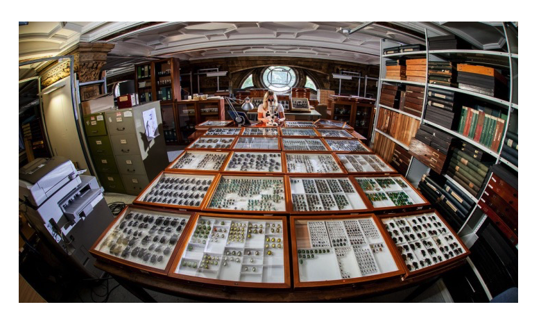

## Whole-drawer imaging
* It is a lot easier and quicker to image 130 thousand drawers rather than 33
million individual insects
* By themselves, drawer-level images aren't very useful
* Manually cropping each image takes too much time and without unique
identifiers the individual images are of questionable value

**The challenge is to efficiently get a single image of each object along
with its associated metadata**

## How Inselect can help
Inselect aims to solve some of the problems associated with whole-drawer imaging
* Identify individual specimens, along with any associated labels
* Place bounding box around each
* Crop out specimen-level images
* Capture metadata such as catalogue numbers, location within the collection, and possibly information on labels
* Associate metadata with the cropped images

# Quick tour

Start Inselect. You should see a list of keyboard shortcuts.

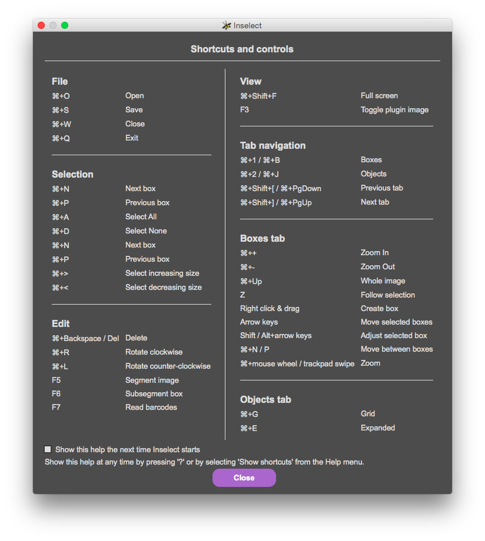

On Windows, many
shortcuts are activated by holding down the `CTRL` key together with another key.
On a Mac, the command button (`⌘`) is used instead of `CTRL`. This workbook
uses `CTRL` - if you are on a Mac, press `⌘` whereever you see `CTRL` written.

The toolbar offers functions relevant to the currently selected view.
The status bar at the bottom shows some useful feedback.

There are two 'views' of an Inselect document.

## The Boxes view

This holds a zoomable, low res version of the whole drawer image together with
bounding boxes:

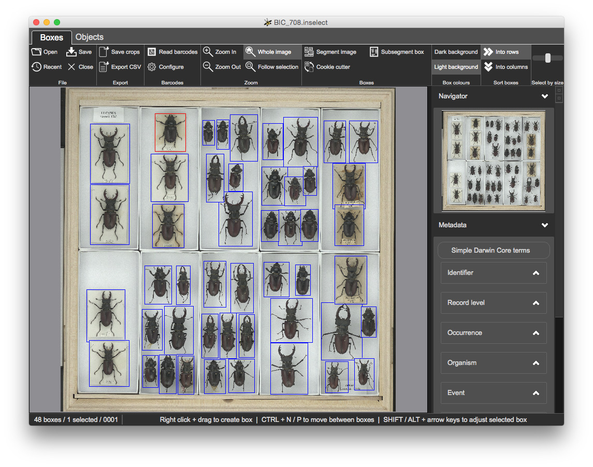

## The Objects view

This shows a grid of icons, one icon for each bounding box:

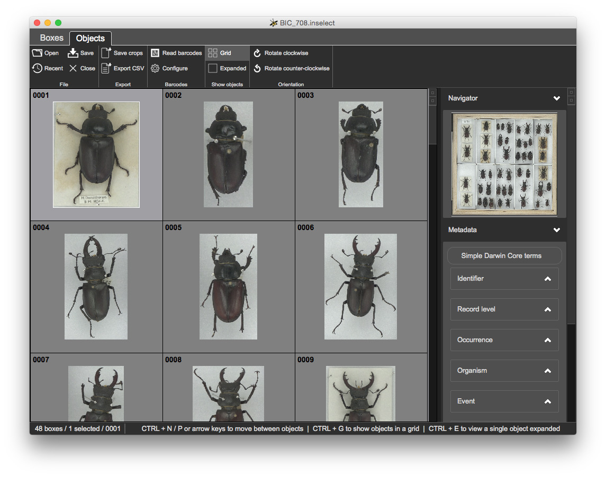

## The panel on the right-hand side

### Navigator

This shows a 'minimap' thumbnail image and indicates where the Boxes view is
zoomed to:

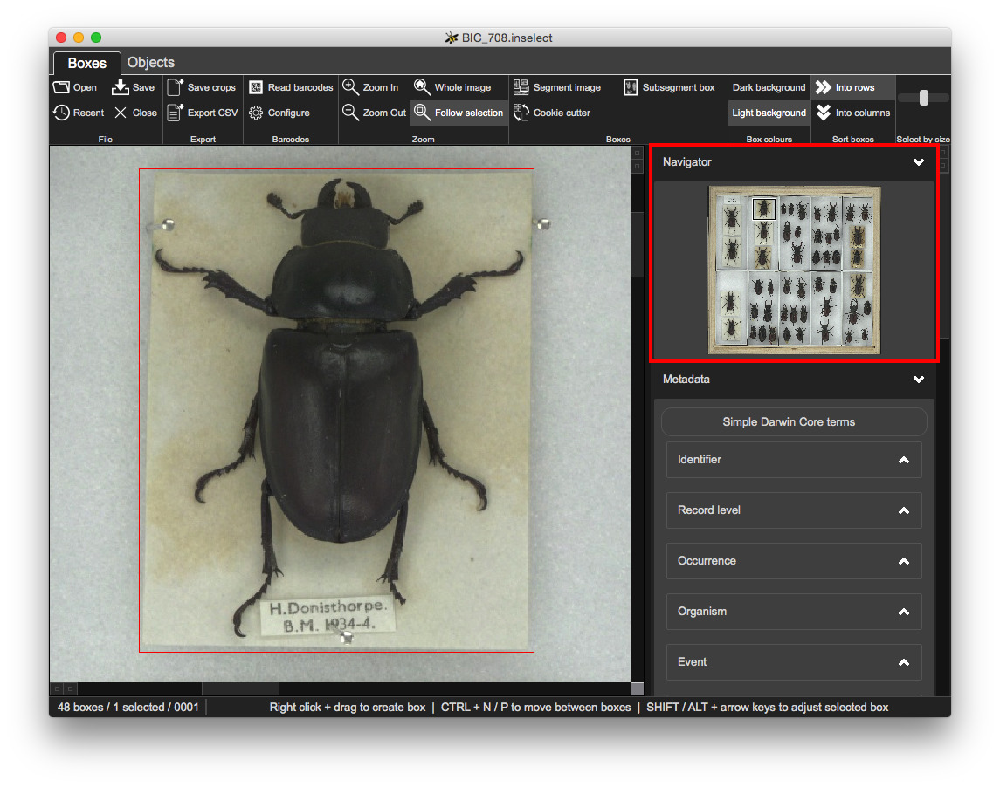

### Metadata fields

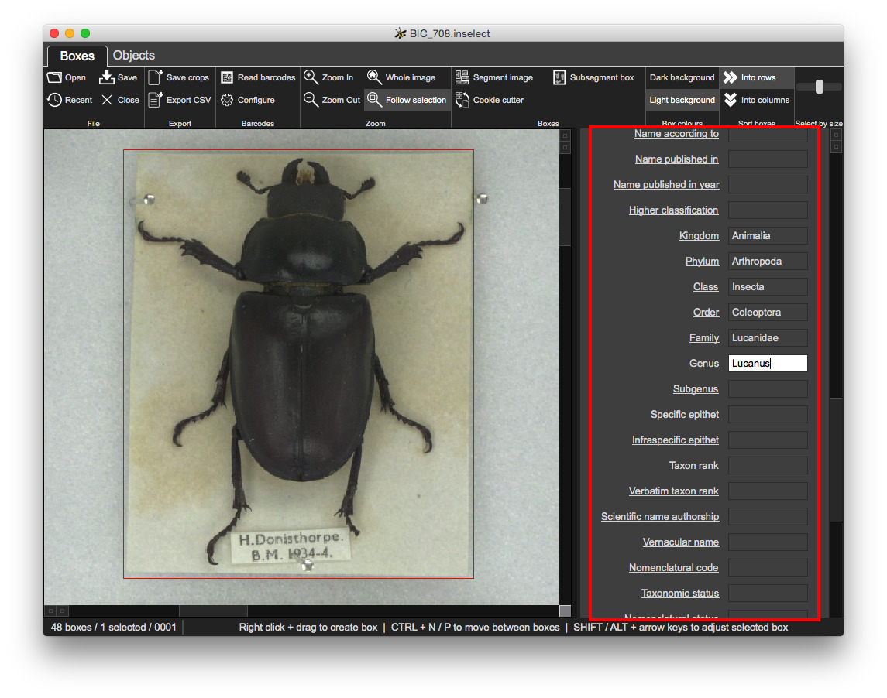

### Information

Some information about the loaded document:

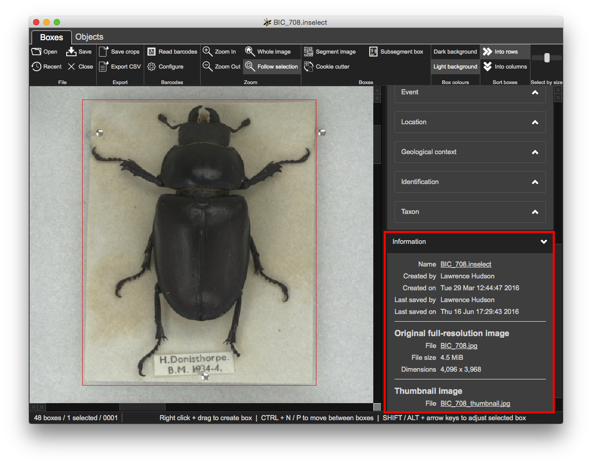

## File sizes

Many digitisation pipelines use `TIFF` images. Whole-drawer `TIFF` images can
be extremely large - up to 800MB is common. The examples in this worksheet use
`JPG` files in order to minimize amount of data that you need to download.

## Words of warning

* Inselect lacks user documentation - the materials for this workshop constitute
all the documentation that there is
* Inselect does not have an 'undo' feature

# Worked example 1 - insect soup

Objective: to place a bounding box around each object in an image and export
each image crop to its own `JPG` file.

This example will cover
* Inselect's image and file handling
* How to create and edit bounding boxes
* How to automatically segment images
* How to subsegment boxes round overlapping objects

## Opening the file

`1.InsectSoup/Img0920+LG+C2.jpg` - an insect soup image of Diptera - true flies
- from Australia, courtesy of the Australian Museum.

Use the open file using one of
* File, Open;
* `CTRL + O` or
* Open button on toolbar
* Drag-and-drop; at the time of writing, this doesn't work on Mac - we
will fix this in a future release

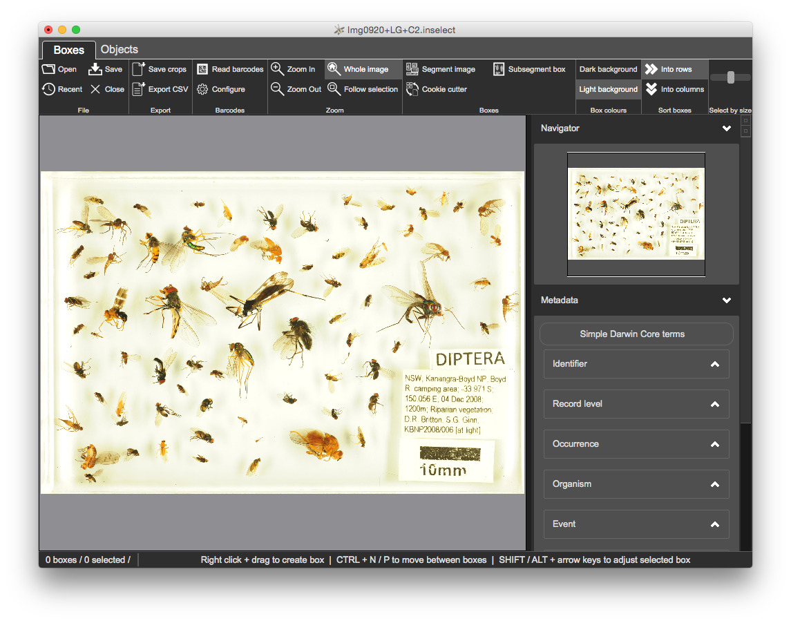

## Created files

Inselect has created two files
1. `Img0920+LG+C2.inselect`

    This is a small file that will contain information about bounding boxes and
    their associated metadata.

2. `Img0920+LG+C2_thumbnail.jpg`

    * Creating the thumbnail `JPG` is a once-only operation
    * The thumbnail `JPG` is very quick to read - far quicker than the large
    high-resolution `TIFF` files that are typically used in digitisation
    programmes
    * Inselect therefore loads and shows the thumbnail whenever the document is
    opened
    * Inselect loads the original full resolution image only as required - when
    saving crops or reading barcodes

## Image handling

On the 'Boxes' view you can zoom in and out by

* Holding down `CTRL` and spinning the mouse wheel up or down
* On a Mac, holding down `⌘` and swiping up or down with two fingers on trackpad
* Holding down `CTRL` and pressing the `+` or `-` keys
* Clicking the toolbar buttons

You can pan around the image by
* Using the scrollbars
* On a Mac, by swiping with two fingers on trackpad

## Creating and edited bounding boxes

You can create boxes with
* Mouse right-click and drag
* On a Mac, click the trackpad using two fingers

You can select boxes
* Mouse drag
* Click on a box
* `CTRL + mouse click` to toggle a box
* Select all with `CTRL + A`
* Select none with `CTRL + D`

You can move selected boxes using
* Mouse drag and drop
* The arrow keys

## Segmenting

Creating boxes by hand is silly - we want to minimise manual steps and get the
computer to do the hard work for us.

Tun Inselect's segmentation algorithm

* click on the 'Segment image' button on the tool bar or
* press `F5`

Inselect will attempt to detect individual objects within the image and place a
bounding box around each. It uses a general purpose algorithm that works well
with many of the different specimen types that we tried. 

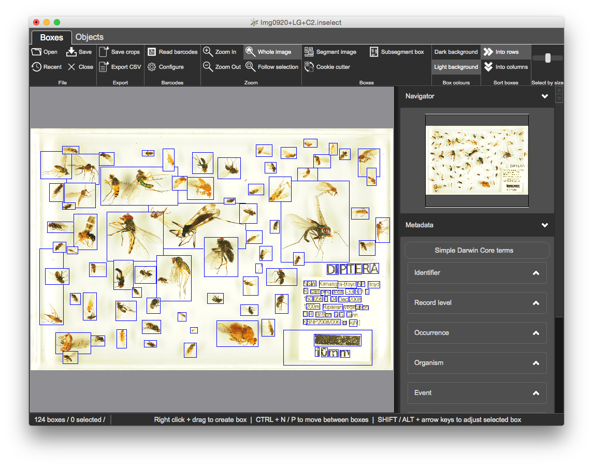

The segmentation does a reasonable job but is not perfect - some manual
refinement is required.

## Refining the results of segmentation

We will check and refine each of the bounding boxes created by the segmentation
algorithm. We will also create any bounding boxes that are missing.

* Click on a box
* Press `Z` to zoom to the current selection
* To navigate to next / previous box
  * `CTRL + N` to go to next box
  * `CTRL + P` to go to the previous box

## Delete unrequired boxes
* `Delete`
* on a Mac `CTRL + ⌫`

## Adjust borders of bounding boxes where they are too big or too small
You can adjust boxes using
* The mouse resize handles
* Keyboard arrow keys
    * `SHIFT +` arrow keys moves the bottom right of the box
    * `ALT +` arrow keys moves the top left of the box

## Split apart boxes that encompass more than one object

This often happens when objects slightly overlap e.g., insect wings. We could
resize the large box and create new ones but this is uneccesary manual work.

* `SHIFT +` click on the approximate centre of object within the bounding box -
Inselect marks each point with a crosshair
* You can remove crosshair by unselecting the box


Run the 'Subsegment box', either from the toolbar or with `F6`

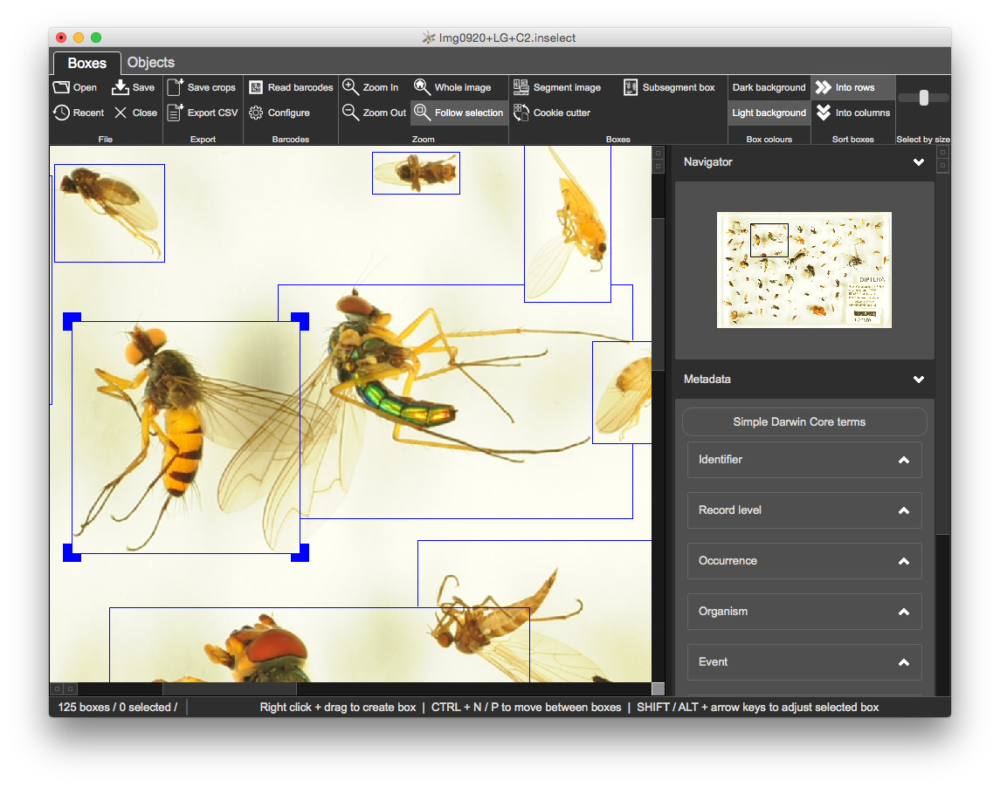

## Export crops

Once you are happy with the bounding boxes, click on 'Save crops' in the
'Export' section of the toolbar.

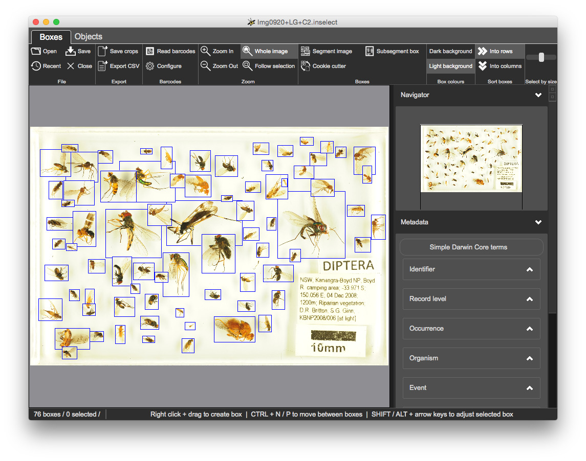

* Inselect loads the original full-resolution image
* It applies bounding boxes to the original full-resolution image and crops
each box
* Saves each box to `JPG` - we could ask Inselect to export to another image
format - this will be covered later
* **No EXIF data are copied**

# Worked example 2 - pinned insects

Objective: to configure and use Inselect metadata templates.

This example will cover
* How inselect treats metadata and validation
* Inselect's metadata template format
* How to export crops and `CSV` files

## Preamble

Open `2.Metadata\Scopelodes_spp_Lim_14.inselect`
* This is a SatScan image of pinned insects - moths in family Limacodidae
* Segment the image and refine bounding boxes

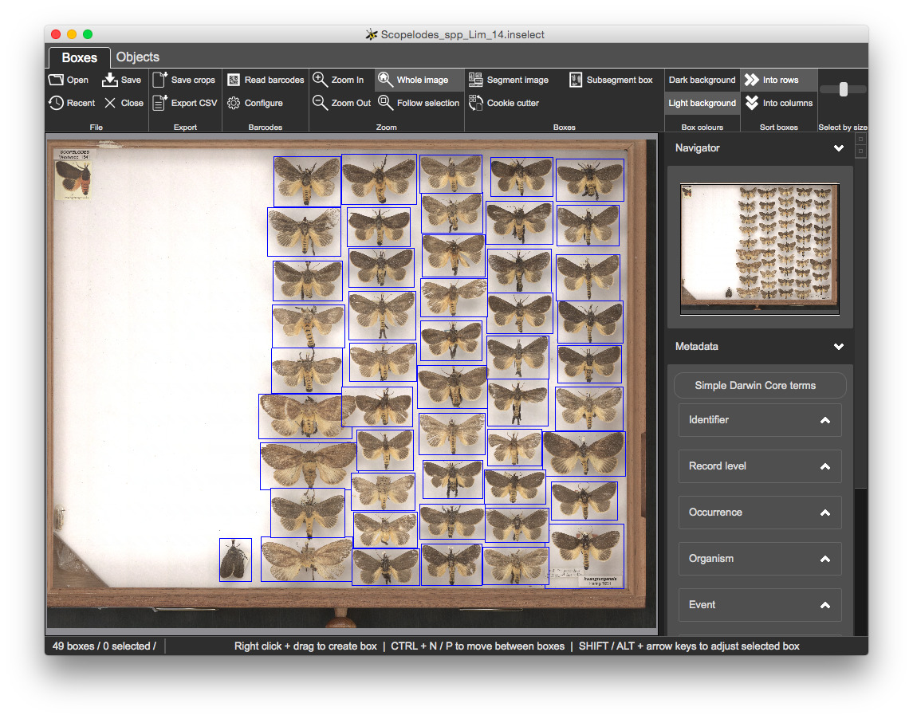

## Metadata template in Inselect

You have complete control over metadata fields and validation through
`.inselect_template` files, which are simple text files that you can edit
using any good text editor.

* Load the `Templates/limacodidae.inselect_template` template by clicking on the
`Simple Darwin Core` button and clicking `Choose...`
* Pink shading over the bounding boxes indicates one or more validation problems,
so we can see at a glance any boxes that need our attention
* The template specifies that the `Location` and `Taxonomy` fields are both
mandatory - newly created bounding boxes have no metadata, so all of the
bounding boxes are shaded pink to indicate a validation probem

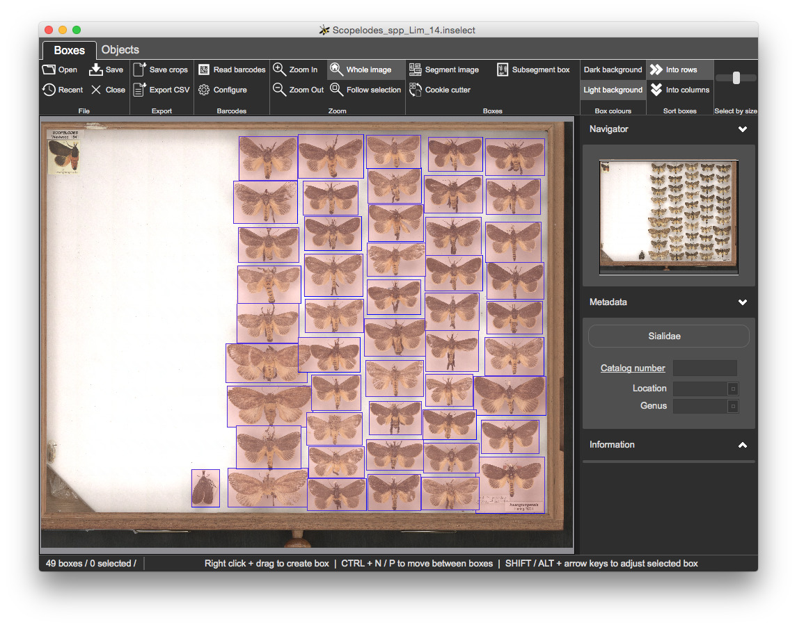

Click on any of the bounding boxes. The `Location` and `Taxonomy` fields are
both coloured pink, indicating a validation problem

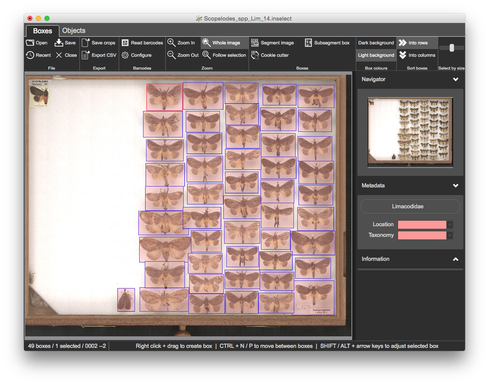

* Set `Location` to Drawer 1
* Set `Taxonomy` to *Scopelodes*
* The pink shading is removed from the fields and box

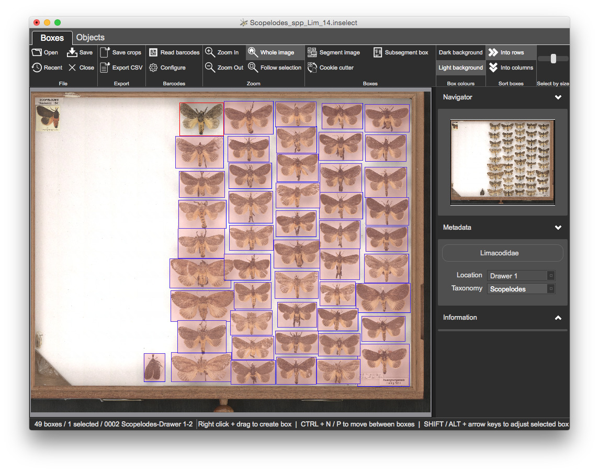

Let's set the metadata for all boxes
* `CTRL + A` to select all boxes
* The field both contain a '*' to indicate multiple values among boxes
* Set `Location` to Drawer 1 and `Location` to *Scopelodes*

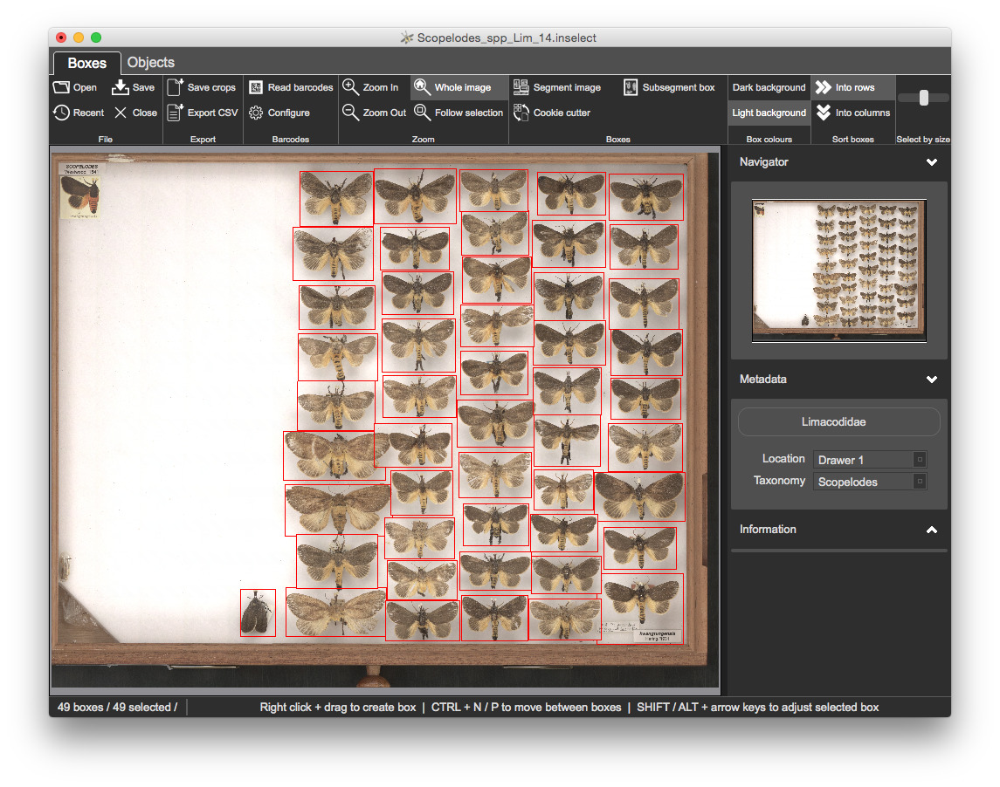

## Metadata panel

The metadata panel on the right shows
[Simple Darwin Core](http://rs.tdwg.org/dwc/terms/simple/) fields
* Links to definitions
* Simple validation e.g., 
* Tag a couple of boxes and show behaviour
* Sensible default but limited

## Creating and editing metadata templates

Files are in a format called YAML (YAML Ain't a Markup Language -
http://yaml.org) - a structured text format. A reference and examples template
files are at https://github.com/NaturalHistoryMuseum/inselect-templates - open
this page in a new browser tab and have a quick look through it.

Open `limacodidae.inselect_template` in your text editor:

```
Name: Limacodidae
Object label: '{Taxonomy}-{Location}-{ItemNumber}'
Fields:
    - Name: Taxonomy
      Mandatory: true
      Choices:
          - Anaxidia
          - Anepopsia
          - Apodecta
          - Birthamoides
          - Calcarifera
          - Chalcocelis
          - Comana
          - Comanula
          - Doratifera
          - Ecnomoctena
          - Elassoptila
          - Eloasa
          - Hedraea
          - Hydroclada
          - Lamprolepida
          - Limacochara
          - Mambara
          - Mecytha
          - Parasoidea
          - Praesusica
          - Pseudanapaea
          - Pygmaeomorpha
          - Scopelodes
          - Squamosa
          - Thosea
    - Name: Location
      Mandatory: true
      Choices:
          - Drawer 1
          - Drawer 2
          - Drawer 3
          - Drawer 4
```

When you come to create your own `.inselect_template` files, it is best to
modify an existing template to suit your needs.

## Editing the template

You will append a new, optional free-text field - `Notes` - to the template.

* Use your text editor to add the field to the template
* Click on the 'Limacoididae' button in Inselect and select 'Reload'

## Export metadata and bounding boxes to a CSV file

Click 'Export CSV' in the toolbar and open the `CSV` file in Excel, 
OpenOffice or similar.

Columns are
* `Cropped_image_name` - the filename of the crop
* `ItemNumber - the number of the bounding box
* Locations of the bounding boxes in
    a. normalised (i.e., between 0 and 1) coordinates - `NormalisedLeft`,
      `NormalisedTop`, `NormalisedRight`, `NormalisedBottom`
    b. coordinates of the thumbnail image - `ThumbnailLeft`, `ThumbnailTop`,
      `ThumbnailRight`, `ThumbnailBottom`
    c. coordinates of the original full-resolution image - `OriginalLeft`,
      `OriginalTop`, `OriginalRight`, `OriginalBottom`

* A column for each of the metadata fields defined in the template
    * `Taxonomy`
    * `Location`
    * `Notes`

# Worked example 3 - microscope slides

Our third example is another SatScan image, this time of microscope slides
arranged in a template. Each of the slides contains a DataMatrix barcode and we
will look at Inselect's barcode reader 

Objective: to read barcodes on microscope slides, rotate each slide to be in
the correct orientation and to export cropped images.

This example will cover
* Barcode reading
* The Objects view
* Rotating objects
* Sorting boxes into rows and columns

## Preamble

* Open `Templates/sialidae.inselect_template`
    * Specifies a higher-resolution thumbnail than used in previous examples -
    useful for reading and transcribing labels on slides
    * Exported crops are saved to `TIFF` files
    * More complex metadata validation
* Load `3.Barcodes/Drawer_40b_w45a_45b_46_47a.inselect`
* Select 'Light background' in the 'Box colours' section of the toolbar
    * This alters the colours of the bounding boxes
    * We hope to automate this in a future release
* Segment


## Refine

There are 100 sockets but automatic segmentation has created 102 boxes. Some of
the sockets do not contain slides but contain red markers that indicate the
location and genus of the slides that follow:

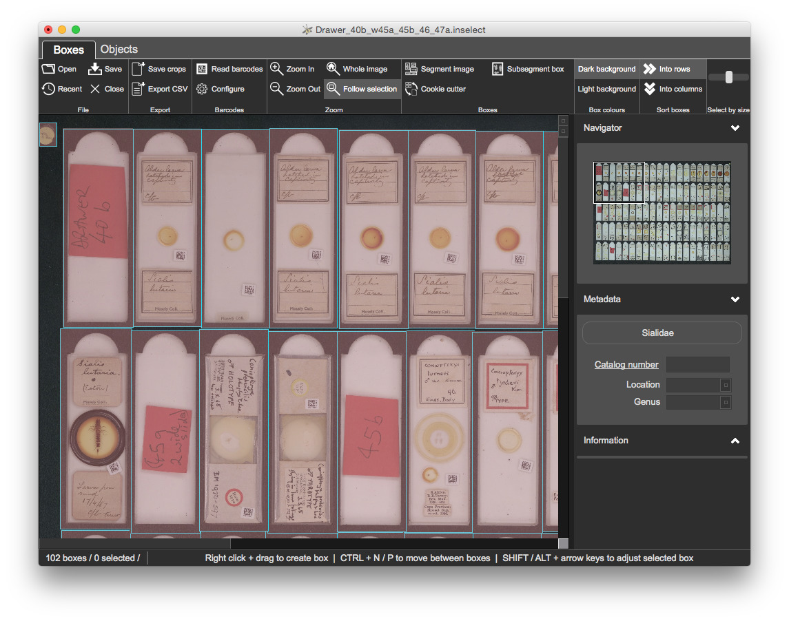

* Remove the boxes around the stickers at the top left and top right
* Remove the boxes around the red markers

Once refined, you should have 95 bounding boxes:

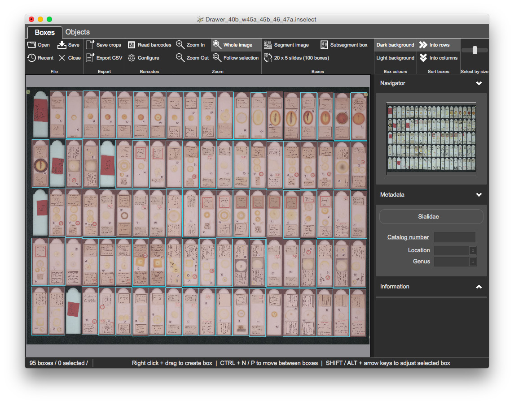

## Metadata template

Open `Templates/sialidae.inselect_template` in your text editor

* The 'catalogNumber' field contains `Regex parser: '^[0-9]{9}$'`

  * This is a regular expression that specifies the field should contain
  exactly nine digits with no letters or punctuation
  * If you do not know what a regular expression is, do not worry

## Setup barcode reading

Select 'Configure' from the 'Barcodes' section of the toolbar:

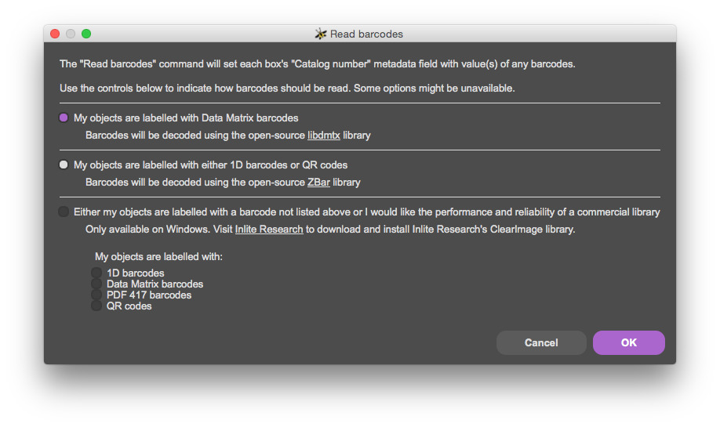

* Inselect comes with two open source options
* The Commercial Inlite ClearImage is faster and is more reliable at reading barcodes
    * Windows only
    * Costly but you can run it for a short time with an evaluation license
    * If you are on Windows
        * Open https://www.inliteresearch.com/barcode-recognition-sdk.php
        * Click 'Download ClearImage SDK' and install
        * Start the 'Inlite control centre' - this will give you an evaluation
        license

## Read barcodes

Read barcodes with `F7`.
* Takes a few minutes to complete
* We are asking quite a lot of the barcode reader - the barcodes make up about 1%
of the area of each crop
* Values of barcodes are always put into 'catalogNumber' field

## Other metadata

You will select the relevant groups of slides and set their values of location
and genus.

Reminders
* You can select bounding boxes with left-click and drag
* You can add / remove individual boxes from the selection by holding down
`CTRL` and left-clicking

Once completed, all metadata should be valid with all boxes clear:

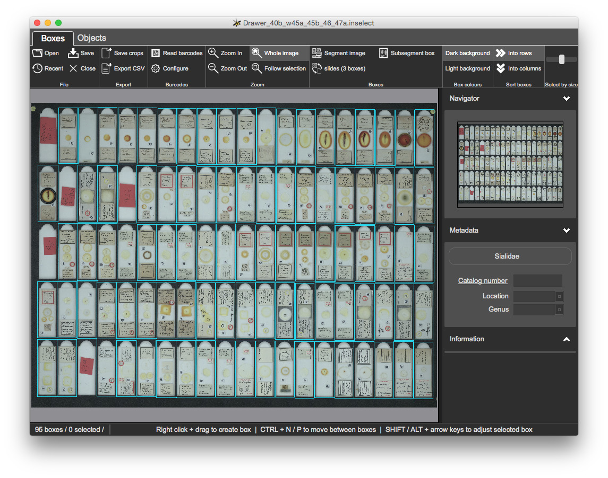

## Sorting boxes

You can sort boxes either by rows or columns.

* Press `CTRL + N` a few times and see how selected box changes
* Now click 'Into columns' in the 'Sort boxes' section of the toolbar
* Press `CTRL + N` a few times again

The selected sort option is applied when you segment an image.

## Objects view

Switch to the Objects view.

Some relevant shortcuts
* `CTRL + 1` / `CTRL + B` - selects the Boxes view
* `CTRL + 2` / `CTRL + J` - selects the Objects view
* Can switch between views using
    * `CTRL + PgUp` / `CTRL + PgDown` on Windows
    * `CMD + [` / `CMD + ]` on Mac

This view shows crops on a grid with a square for each bounding box, along with
each box's number and object label:

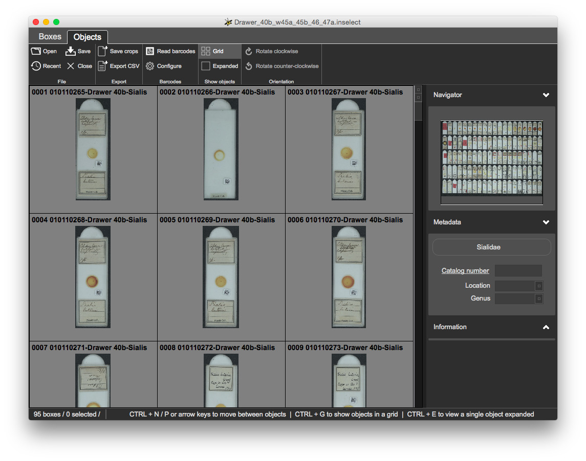

* You can expand a single box
    * press `Enter`
    * double click
    * `CTRL + E`

* Move forwards and backwards through boxes
    * up and down arrows
    * `CTRL + N` and `CTRL + P` - Next / Previous

* You can go back to the grid
    * Press `Enter`
    * Double click
    * `CTRL + G`

Selection
* You can select icon using the mouse
* You can select squares using SHIFT + arrow keys
* As you might expect `CTRL + A` and `CTRL + D` - the standard shortcuts for
Select all and Select none - also work here
* Just as before, the metadata fields reflect the selection

## Rotation

You will rotate each crop so that labels are in the correct orientation.

* `CTRL + R` to rotate right
* `CTRL + L` to rotate left
* Applied to current selection, so you can block-select and rotate.
* Useful for reading labels
* Rotation is applied to crops so when they are saved

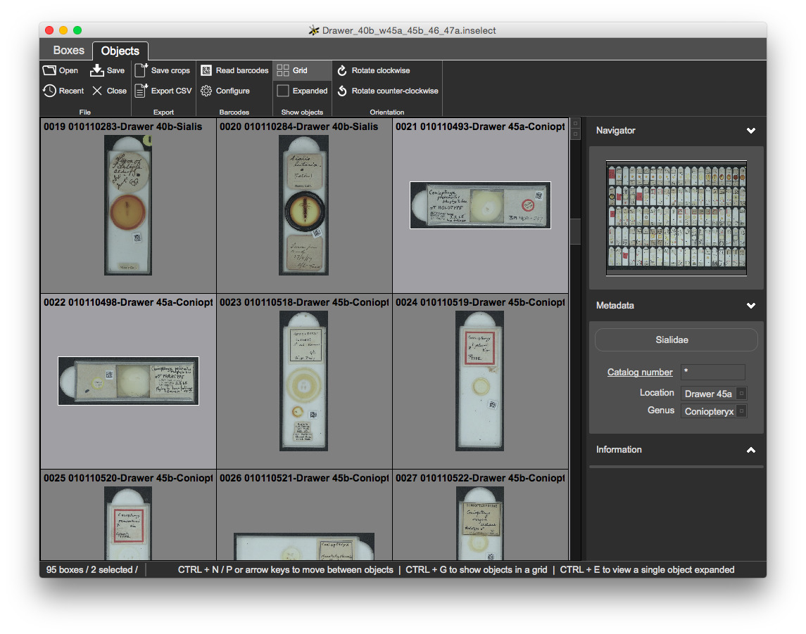

## Export crops

Click 'Save crops'

Open the directory containing the crops.
* Filenames from metadata template
* Saves to `TIFF` files, as specified in the metadata template
* Has Inselect exported crops with the rotation the you specified?

<!-- ## Document-level validation

* Select the first three boxes in the first row
* Set the 'Catalog number' for these boxes to the same valid value - '010000000'
* Click 'Export crops'

What does Inselect do?
* Do both boxes contain valid metadata?
* Do you understand the message that Inselect shows you?
* Answer 'Yes' to the 'Would you like to save the object images?' question
 - look at the names of the first three exported crops - how has Inselect treated the filenames of the first three boxes?
 -->

# Worked example 4 - cookie cutter templates

The microscope slides are arranged on a 20 x 5 template. If you are regularly
dealing with hundreds or thousands of sacnned images with an identical
arrangement of objects then automatic segmentation is imperfect.

Objective: to create and use cookie cutter templates.

This example will cover creating and applying cookie cutter template.

## Create cookie cutter template for slides

With 
* Open `Drawer_76_77_78_79_81_83a.jpg`
* Segment and delete the three erroneous boxes
* Check that the 100 bounding boxes are in the right places

* Click 'Cookie cutter' on the toolbar and select 'Save boxes to new cookie cutter...'
    Call it `20 x 5 slides`
* Inselect saves the bounding boxes only to the template - metadata is not saved
* Inselect sets the new file as the current cookie cutter

## Apply cookie cutter

Open `Drawer_60b_61_62a.jpg`
Inselect creates boxes using cookie cutter.

* Select all, zoom in, fine tune exact positons with mouse or keyboard
* Unsatisfactory, crude solution but has proved to be a time saver  - need a
more automated method

# Command-line tools

* If you expect to be working on batches of hundreds or thousands of images
* An advanced topic
* Requires some IT knowledge so best undertaken together with your IT staff

Objective: to ingest the five example image files in `5.CommandLineTools` and
apply the cookie cutter that you previously created.

This example will provide an introduction to Inselect's command line tools.

## Workflow

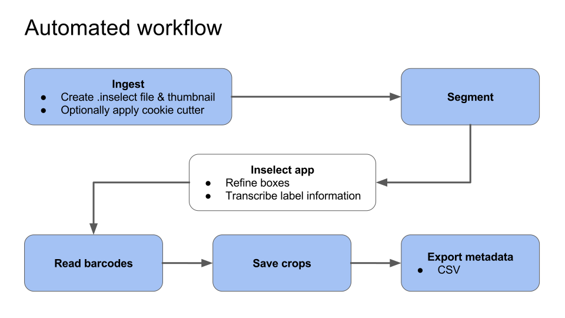

Each of the operations shown in blue has an associated command-line tool.
You can pick and choose the relevant command-line tools together with cookie
cutters and metadata templates to integrate Inselect into your existing
workflows.
Descriptions of each tool are below.

### `ingest`
* You provide the paths to an input directory and on output directory; these can
be the same
* For each image file in the input directory
    * Moves the image to the output directory
    * Creates the `.inselect` file
    * Create the thumbnail `JPG`; you can provide the resolution
    * Optionally applies a cookie cutter

### `segment`
* You provide the path to a directory
* For each `.inselect` file in the directory
    * Runs automatic segmentation
    * You can specify whether to sort boxes by columns or by rows

### `read_barcodes`
* You provide the path to a directory
* For each `.inselect` file in the directory
    * Reads barcodes using the reader that you specify

### `export_metadata`
* You provide the path to a directory
* For each `.inselect` file in the directory
    * Writes a `CSV` file of metadata
    * You can specify an Inselect template file
    * Files with validations errors are ignored

### `save_crops`
* You provide the path to a directory
* For each `.inselect` file in the directory
    * Writes cropped images
    * You can specify an Inselect template file that will be used to format the
    crop filenames
    * Files with validations errors are ignored

## Test that you can run tools

Start the Windows command prompt.
The following code fragments assume that you installed Inselect to the default
location of `C:\Program Files\inselect`. You should alter the paths as required,
if you installed the program to a different directory.

Each tool supports the `--help` argument:

```
C:\Program Files\inselect\ingest.exe --help
```

You should see
```
usage: ingest.exe [-h] [-c COOKIE_CUTTER] [-w THUMBNAIL_WIDTH] [--debug] [-v]
                  inbox docs

Ingests images into Inselect

positional arguments:
  inbox                 Source directory containing scanned images
  docs                  Destination directory to which images will be moved
                        and in which Inselect documents will be created. Can
                        be the same as inbox.

optional arguments:
  -h, --help            show this help message and exit
  -c COOKIE_CUTTER, --cookie-cutter COOKIE_CUTTER
                        Path to a '.inselect_cookie_cutter' file that will be
                        applied to new Inselect documents
  -w THUMBNAIL_WIDTH, --thumbnail-width THUMBNAIL_WIDTH
                        The width of the thumbnail in pixels; defaults to 4096
  --debug
  -v, --version         show program's version number and exit
```

## Ingest images

The `5.CommandLineTools` directory contains five `JPG` files. Run

```
C:\Program Files\inselect\ingest.exe --thumbnail-width 8000 \
    --cookie-cutter <path to the inselect_cookie_cutter file> \
    <path to the 5.CommandLineTools directory> \
    <path to the 5.CommandLineTools directory>
```

* What did the `ingest` tool report?
* One of the image files has a deliberate error - how did the `ingest` tool
behave?

## Roundup

* Inselect home page: https://github.com/NaturalHistoryMuseum/inselect
* Contact me at l.hudson@nhm.ac.uk
* Do you have an idea for this software or would you like to report a problem?
  Raise an issue at https://github.com/NaturalHistoryMuseum/inselect/issues
